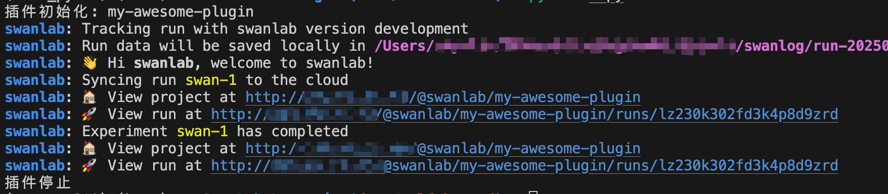
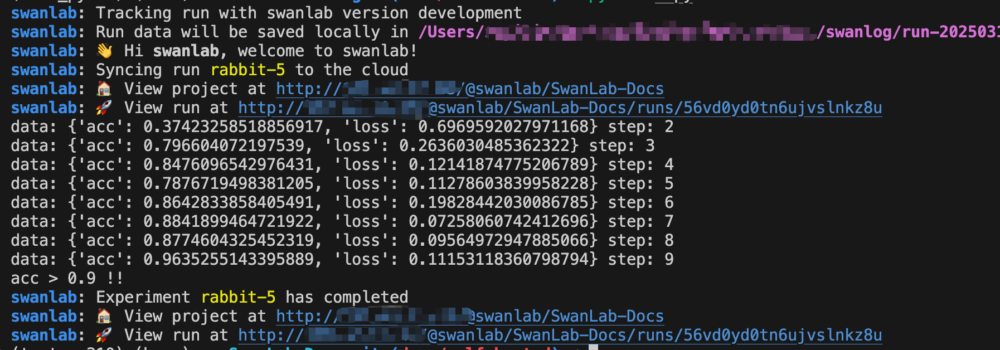

# 制作你的自定义插件

很开心，在`swanlab>=0.5.0`之后，我们正式开启了插件时代！

插件是SwanLab诞生之初我们便一直探讨的话题，这不仅是增强SwanLab的功能与开放性，更是一种全新的视角来看待SwanLab ——

SwanLab不只是1个训练跟踪工具与实验管理平台，同时可以是一个训练过程中的**数据核心**（比如Chrome core），`swanlab.init`与`swanlab.log`被赋予不同的意义。

---

我们将SwanLab的插件模式定义为三种类型：

- **`Python库插件`**：SwanLab Python库中的回调类（Callback）。通过往SwanLab的生命周期阶段（比如`on_init`、`on_run`、`on_stop`等）注入代码的方式，来实现插件功能。
- **`开放API插件`**：基于SwanLab平台提供的开放API，通过调用API进行组合的方式，来实现插件功能。
- **`GUI插件`**：基于SwanLab平台开放的前端API，实现对图表、表格等组件的定制化。

::: warning 👋 支持情况
目前我们支持的插件类型为`Python库插件`，下面我将重点介绍如何制作你的`Python库插件`。
:::

## 认识SwanKitCallback类

> 仓库：[swanlab-toolkit](https://github.com/swanhubx/swanlab-toolkit)

`SwanKitCallback`类是SwanLab的回调类，所有插件都必须继承自该类。

```python
from swankit.callback import SwanKitCallback
```

`SwanKitCallback`类中定义了所有SwanLab的生命周期阶段，你只需要重写你感兴趣的生命周期阶段即可：

常用的生命周期阶段有：

- `on_init`：初始化阶段，执行`swanlab.init`时调用
- `before_init_experiment`：在初始化`SwanLabRun`之前调用
- `on_run`：当`SwanLabRun`初始化完毕时调用
- `on_log`：每次执行`swanlab.log`时调用
- `on_stop`：停止阶段，当SwanLab停止时调用

更多的生命周期阶段，请参考：[SwanKitCallback](https://github.com/SwanHubX/SwanLab-Toolkit/blob/main/swankit/callback/__init__.py)

## 实现一个简单的插件

下面以1个案例为例，介绍如何实现一个插件。

```python
class MyPlugin(SwanKitCallback):
    def on_init(self, proj_name: str, workspace: str, logdir: str = None, *args, **kwargs):
        print(f"插件初始化: {proj_name} {workspace} {logdir}")

    def on_stop(self, error: str = None, *args, **kwargs):
        print(f"插件停止: {error}")

    def __str__(self):
        return "MyPlugin"
```

这个插件实现的功能非常简单，就是在`swanlab.init()`调用时打印1条消息，在进程停止或`swanlab.finish()`调用时打印1条消息。

而在SwanLab中使用着这个插件非常简单，只需要在`swanlab.init()`的`callbacks`参数中传入插件实例即可。

```python {14,16}
from swankit.callback import SwanKitCallback
import swanlab

class MyPlugin(SwanKitCallback):
    def on_init(self, proj_name: str, workspace: str, logdir: str = None, *args, **kwargs):
        print(f"插件初始化: {proj_name} {workspace} {logdir}")

    def on_stop(self, error: str = None, *args, **kwargs):
        print(f"插件停止: {error}")

    def __str__(self):
        return "MyPlugin"

my_plugin = MyPlugin()

swanlab.init(callbacks=[my_plugin])
```

执行上述代码，你会在控制台看到




## 案例：指标打印与告警

我们来实现一个插件，这个插件的功能是打印指标，并当指标`acc`大于0.9时，打印1条消息，并发送告警。

### 1. 定义插件

> 在`SwanKitCallback`类中，定义了`on_log`方法，每次执行`swanlab.log`时都会调用该方法。

```python
class ThresholdPlugin(SwanKitCallback):
    def __init__(self, key: str, threshold: float = 0.9):
        self.key = key
        self.threshold = threshold

    def on_log(self, data: dict, step: Optional[int] = None, *args, **kwargs):
        print(f"data: {data} step: {step}")
        if data[self.key] > self.threshold:
            print(f"{self.key} > {self.threshold} !!")
```

### 2. 使用插件

```python
from swankit.callback import SwanKitCallback
from typing import Optional
import swanlab
import random

class ThresholdPlugin(SwanKitCallback):
    def __init__(self, key: str, threshold: float = 0.9):
        self.key = key
        self.threshold = threshold

    def on_log(self, data: dict, step: Optional[int] = None, *args, **kwargs):
        print(f"data: {data} step: {step}")
        if data[self.key] > self.threshold:
            print(f"{self.key} > {self.threshold} !!")

    def __str__(self):
        return "ThresholdPlugin"

threshold_plugin = ThresholdPlugin(key="acc", threshold=0.9)
swanlab.init(callbacks=[threshold_plugin])

# 模拟一次训练
epochs = 10
offset = random.random() / 5
for epoch in range(2, epochs):
  acc = 1 - 2 ** -epoch - random.random() / epoch - offset
  loss = 2 ** -epoch + random.random() / epoch + offset

  # 记录训练指标
  swanlab.log({"acc": acc, "loss": loss}, step=epoch)
```

执行上述代码，你会在控制台看到




## 学习更多插件

- [EmailCallback](/zh/plugin/notification-email.md)：训练完成/发生错误时，发送消息到邮箱
- [LarkCallback](/zh/plugin/notification-lark.md)：训练完成/发生错误时，发送消息到飞书
