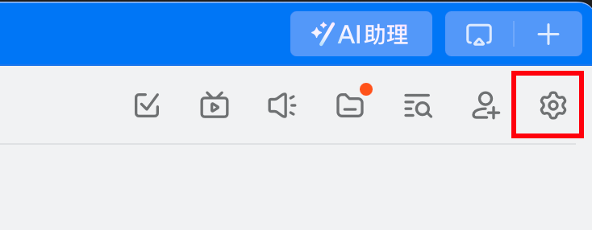
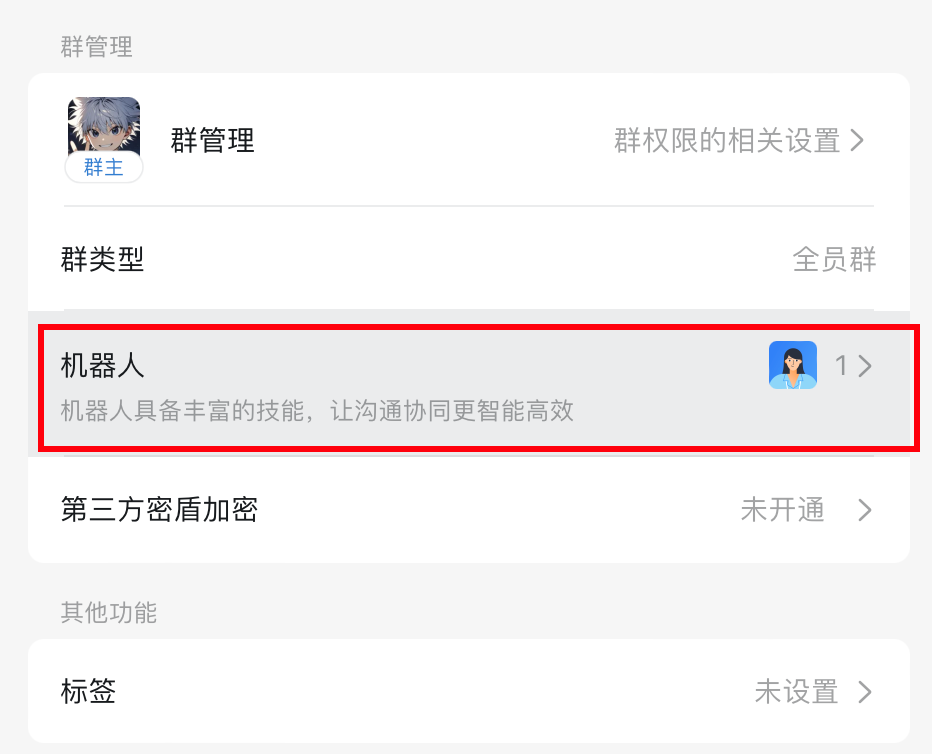
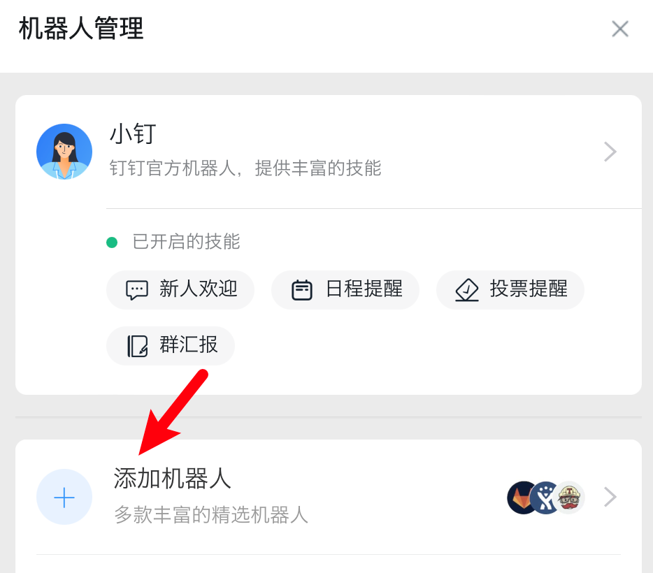
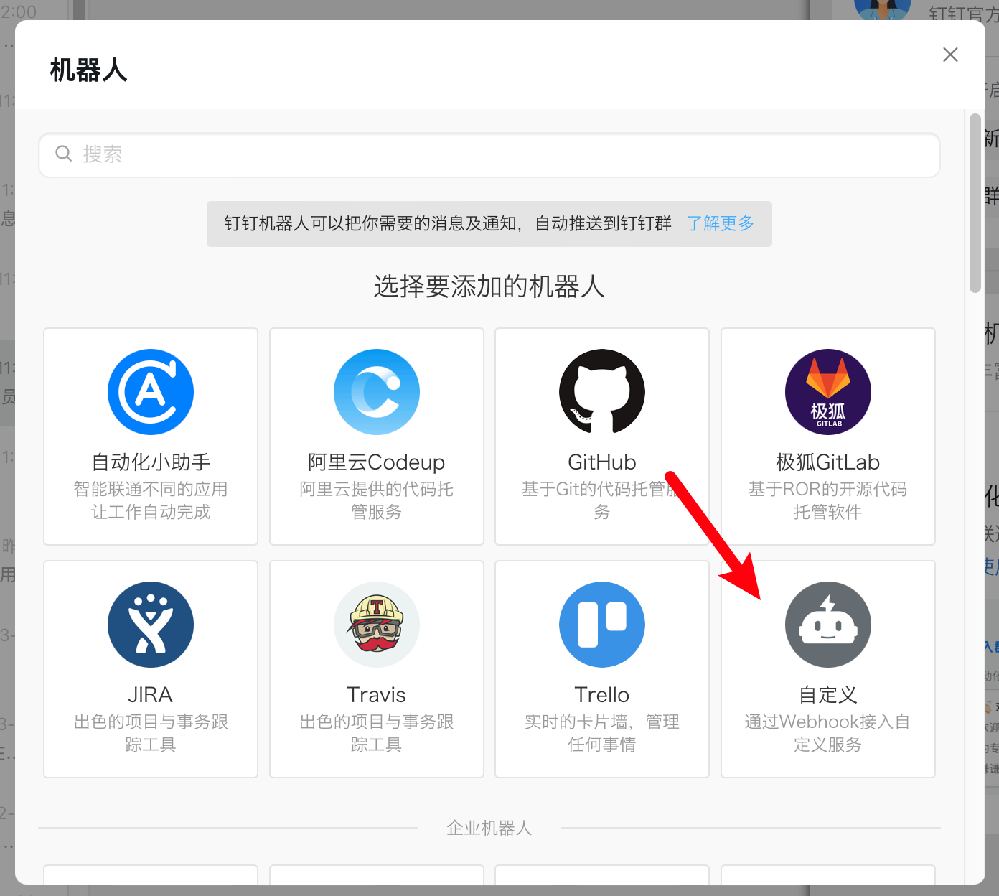
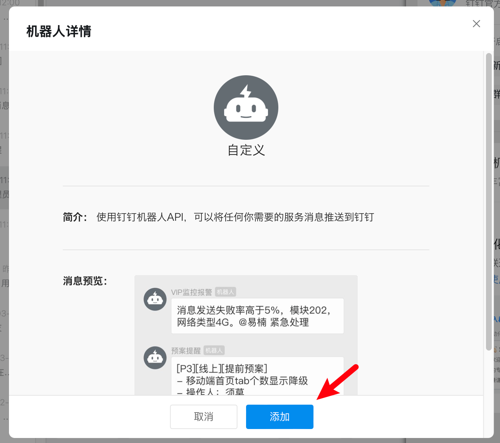
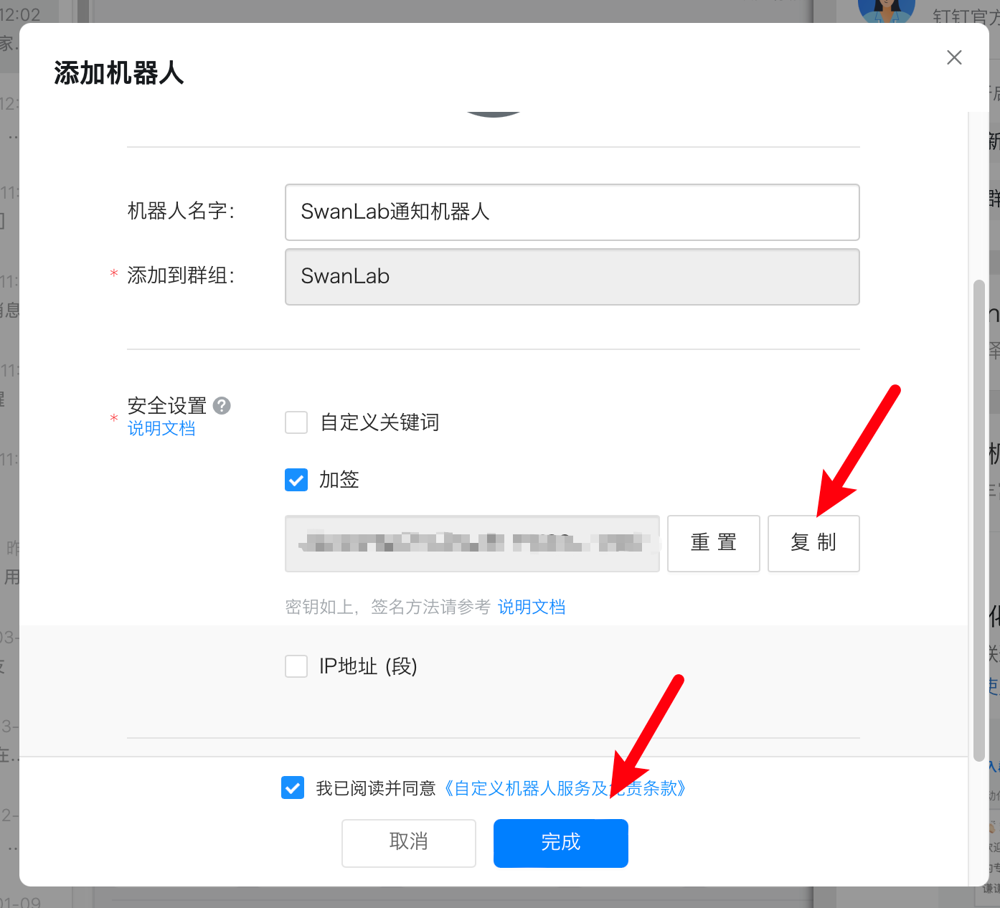
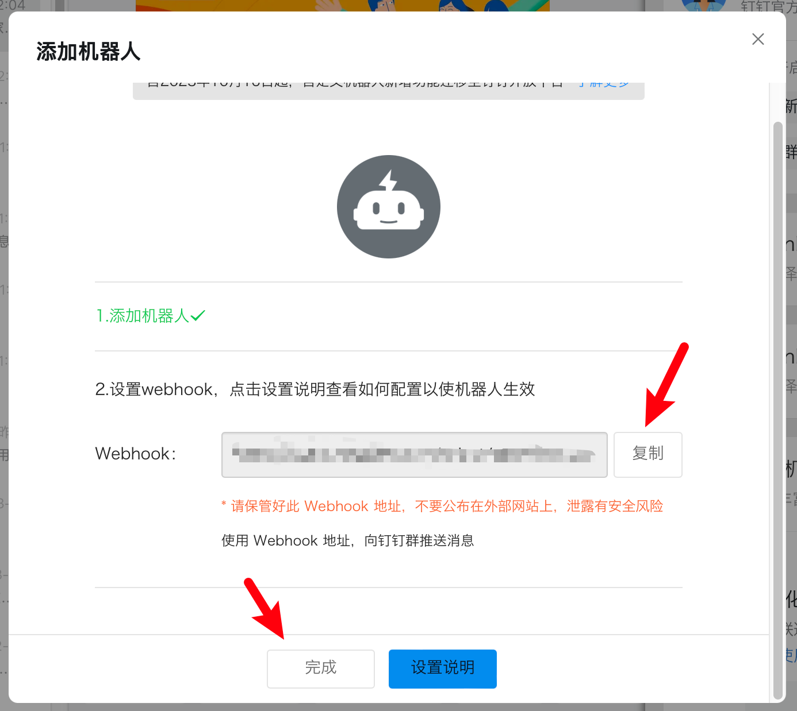
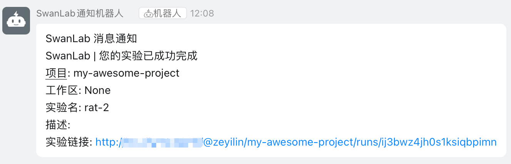

# 钉钉


如果你希望在训练完成/发生错误时，第一时间发送[钉钉](https://www.dingtalk.com/)信息通知你，那么非常推荐你使用钉钉通知插件。

:::warning 改进插件
SwanLab插件均为开源代码，你可以在[Github源代码](https://github.com/swanhubx/swanlab/blob/main/swanlab/plugin/notification.py)中查看，欢迎提交你的建议和PR！
:::

[[toc]]

## 准备工作

1. 在1个钉钉群（企业群）中，点击右上角的 **「设置」按钮**



2. 向下滚动，找到 **「机器人」**



3. 点击 **「添加机器人」**



4. 添加 **「自定义机器人」**





勾选「加签」，复制token到外部。



复制webhook，完成机器人创建：



至此，你完成了准备工作。

## 基本用法

使用钉钉通知插件的方法非常简单，只需要初始化1个`DingTalkCallback`对象：

```python
from swanlab.plugin.notification import DingTalkCallback

dingtalk_callback = DingTalkCallback(
    webhook_url="https://oapi.dingtalk.com/robot/xxxx", 
    secrets="xxxx",
)
```

然后将`dingtalk_callback`对象传入`swanlab.init`的`callbacks`参数中：

```python
swanlab.init(callbacks=[dingtalk_callback])
```

这样，当训练完成/发生错误时（触发`swanlab.finish()`），你将会收到钉钉信息通知。



## 自由提醒

你还可以使用`DingTalkCallback`对象的`send_msg`方法，发送自定义的钉钉信息。

这在提醒你某些指标达到某个阈值时非常有用！

```python 
if accuracy > 0.95:
    # 自定义场景发送消息
    dingtalk_callback.send_msg(
        content=f"Current Accuracy: {accuracy}",  # 通知内容
    )
```


## 限制

- 钉钉通知插件的训练完成/异常通知，使用的是`SwanKitCallback`的`on_stop`生命周期回调，所以如果你的进程被突然`kill`，或者训练机异常关机，那么会因为无法触发`on_stop`回调，从而导致未发送钉钉通知。

- 完善方案请期待`SwanLab`的`平台开放API`上线。