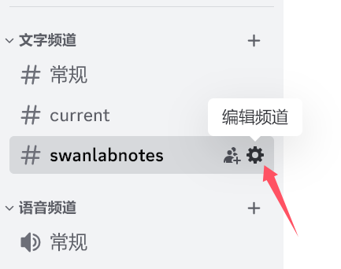
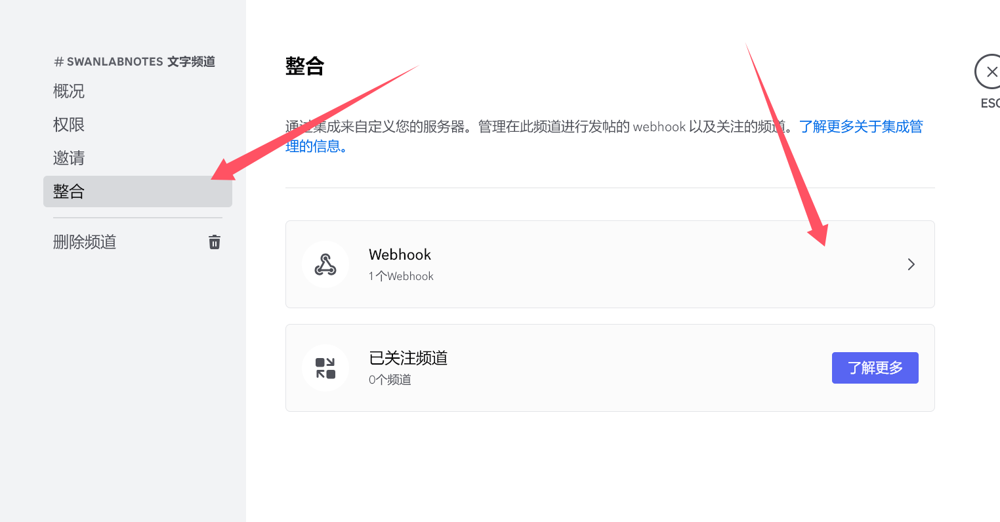
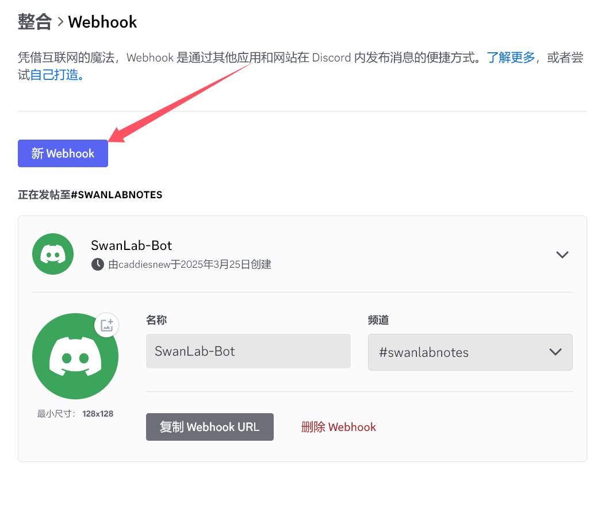
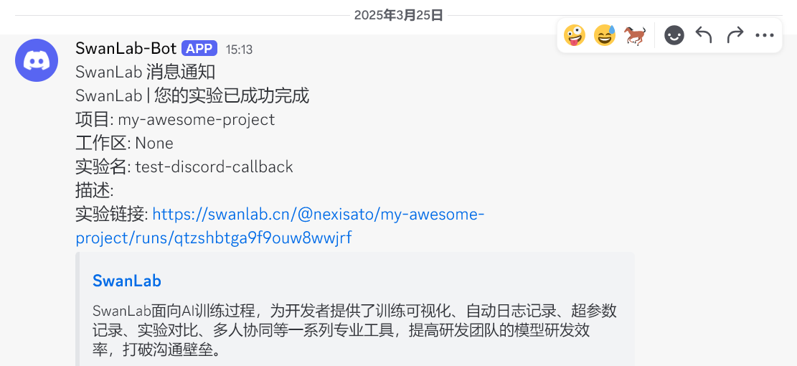

# Discord


如果你希望在训练完成/发生错误时，第一时间发送[Discord](https://discord.com/)信息通知你，那么非常推荐你使用Discord通知插件。

:::warning 改进插件
SwanLab插件均为开源代码，你可以在[Github源代码](https://github.com/swanhubx/swanlab/blob/main/swanlab/plugin/notification.py)中查看，欢迎提交你的建议和PR！
:::

[[toc]]

## 准备工作

::: info 参考文档
- [Discord-Webhook群机器人配置说明](https://support.discord.com/hc/en-us/articles/228383668-Intro-to-Webhooks)
:::


1. 选择您想要接收SwanLab事件通知的 Discord 频道


2. 点击对应频道右侧的 **「⚙️」** 对应的 **「编辑频道」** 按钮



3. 展开菜单后，选择 **「整合」 -> 「Webhhook」**




4. 点击选项卡 **「新Webhook」** 自动创建新的 webhook 机器人



5. 点击 **「复制 Webhook URL」** 即可获取到对应的 webhook 地址


## 基本用法

使用Discord通知插件的方法非常简单，只需要初始化1个`DiscordCallback`对象：

```python
from swanlab.plugin.notification import WXWorkCallback

discord_callback = DiscordCallback(
    webhook_url='https://discord.com/api/webhooks/xxxxx/xxx', 
    language='zh'
)
```

然后将`discord_callback`对象传入`swanlab.init`的`callbacks`参数中：

```python
swanlab.init(callbacks=[discord_callback])
```

这样，当训练完成/发生错误时（触发`swanlab.finish()`），你将会收到Discord消息通知。




## 自由提醒

你还可以使用`DiscordCallback`对象的`send_msg`方法，发送自定义的的Discord消息。

这在提醒你某些指标达到某个阈值时非常有用！

```python 
if accuracy > 0.95:
    # 自定义场景发送消息
    discord_callback.send_msg(
        content=f"Current Accuracy: {accuracy}",  # 通知内容
    )
```


## 限制

- Discord通知插件的训练完成/异常通知，使用的是`SwanKitCallback`的`on_stop`生命周期回调，所以如果你的进程被突然`kill`，或者训练机异常关机，那么会因为无法触发`on_stop`回调，从而导致未发送Discord通知。

- 完善方案请期待`SwanLab`的`平台开放API`上线。