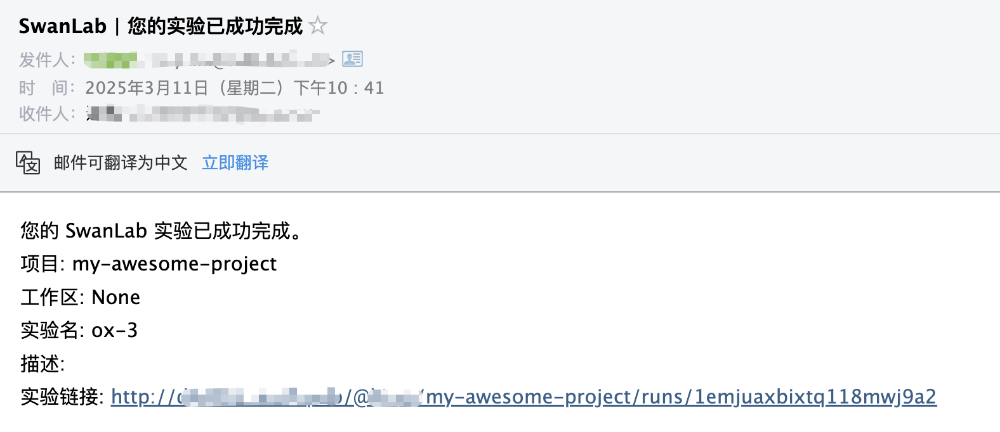

# 邮件通知


如果你希望在训练完成/发生错误时，第一时间发送邮件通知你，那么非常推荐你使用`邮件通知`插件。

:::warning 改进插件
SwanLab插件均为开源代码，你可以在[Github源代码](https://github.com/swanhubx/swanlab/blob/main/swanlab/plugin/notification.py)中查看，欢迎提交你的建议和PR！
:::

[[toc]]

## 准备工作

在使用插件前，首先你需要准备开通你的邮箱的**STMP服务**。以QQ邮箱为例：

**步骤 1：进入邮箱设置**

- 进入QQ邮箱网页，点击顶部的 ​​“设置”​ 
- 在设置菜单中，选择 ​​“账号”​ 选项。

**​步骤 2：开启SMTP服务**

- 找到 **“POP3/IMAP/SMTP/Exchange/CardDAV/CalDAV服务”**
- 在“服务状态”旁边，点击 **“开启服务”**
- 经过一些身份验证流程后，完成**STMP服务的开启**
- （重要）保存给到你的**授权码**

**​步骤 3：记录以下信息**
- **SMTP服务器地址**: smtp.qq.com
- **端口**: 465（SSL加密）或 587（TLS加密）
- **发送邮箱**: 你的完整QQ邮箱地址（如 123456789@qq.com）
- **密码**: 使用你刚刚获取的 ​授权码，而不是QQ邮箱的登录密码。

其他的邮箱服务基本都支持STMP，可按照相似的流程开启服务。


## 基本用法

使用邮件通知插件的方法非常简单，只需要初始化1个`EmailCallback`对象：

```python
from swanlab.plugin.notification import EmailCallback

# 初始化邮件通知插件
email_callback = EmailCallback(
    sender_email="<发送者邮箱，即开启SMTP服务的邮箱>",
    receiver_email="<接收者邮箱，即你想要收到邮件的邮件>",
    password="<你的授权码>",
    smtp_server="<你的邮箱服务器>",
    port=587,
    language="zh",
)
```

然后将`email_callback`对象传入`swanlab.init`的`callbacks`参数中：

```python
swanlab.init(callbacks=[email_callback])
```

这样，当训练完成/发生错误时（触发`swanlab.finish()`），你将会收到邮件通知。





## 自由提醒

你还可以使用`EmailCallback`对象的`send_email`方法，发送自定义的邮件。

这在提醒你某些指标达到某个阈值时非常有用！

```python 
if accuracy > 0.95:
    # 自定义场景发送邮件
    email_callback.send_email(
        subject="SwanLab | Accuracy > 0.95",  # 邮件标题
        content=f"Current Accuracy: {accuracy}",  # 邮件内容
    )
```


## 限制

- 邮件通知插件的训练完成/异常通知，使用的是`SwanKitCallback`的`on_stop`生命周期回调，所以如果你的进程被突然`kill`，或者训练机异常关机，那么会因为无法触发`on_stop`回调，从而导致未发送邮件通知。

- 完善方案请期待`SwanLab`的`平台开放API`上线。