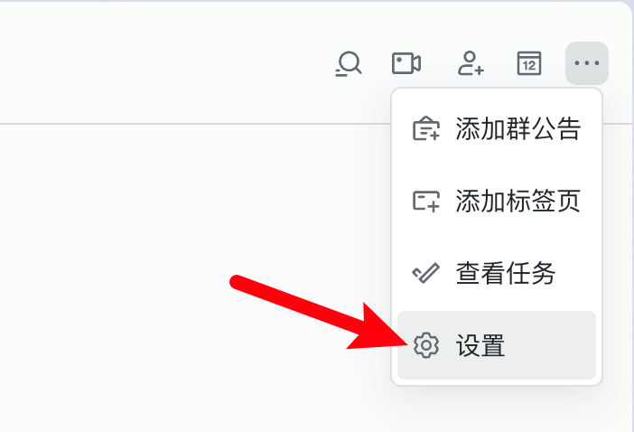
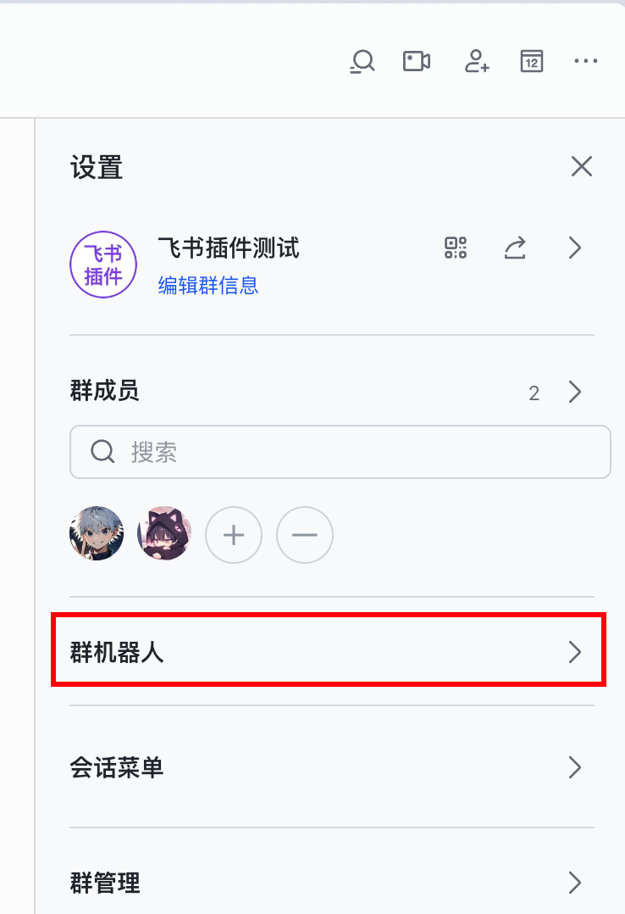
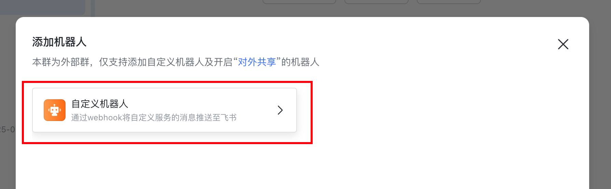
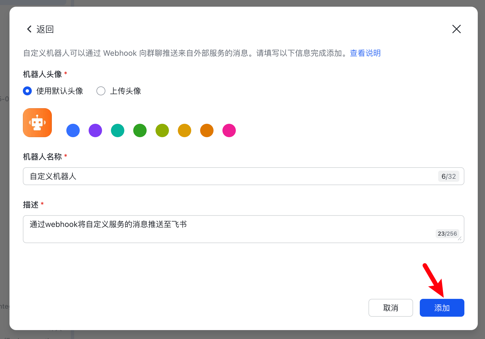
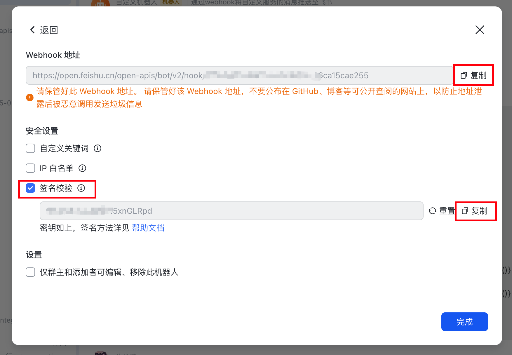
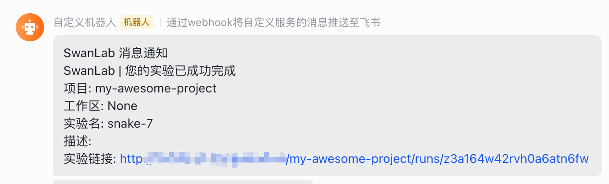

# 飞书通知


如果你希望在训练完成/发生错误时，第一时间发送飞书信息通知你，那么非常推荐你使用飞书通知插件。

:::warning 改进插件
SwanLab插件均为开源代码，你可以在[Github源代码](https://github.com/swanhubx/swanlab/blob/main/swanlab/plugin/notification.py)中查看，欢迎提交你的建议和PR！
:::

[[toc]]

## 准备工作

::: info 参考文档
- [自定义机器人API使用指南](https://open.feishu.cn/document/client-docs/bot-v3/add-custom-bot?lang=zh-CN#f62e72d5)·
- [在飞书群组中使用机器人](https://www.feishu.cn/hc/zh-CN/articles/360024984973-%E5%9C%A8%E7%BE%A4%E7%BB%84%E4%B8%AD%E4%BD%BF%E7%94%A8%E6%9C%BA%E5%99%A8%E4%BA%BA)
:::


1. 在1个飞书群中，点击右上角的 **「···」-「设置」**



2. 点击 **「群机器人」**



3. 点击 **「添加机器人」**


4. 添加 **「自定义机器人」**





5. 复制 **「Webhook 地址」和 「签名」**



至此，你完成了准备工作。

## 基本用法

使用飞书通知插件的方法非常简单，只需要初始化1个`LarkCallback`对象：

```python
from swanlab.plugin.notification import LarkCallback

lark_callback = LarkCallback(
    webhook_url="https://open.larkoffice.com/open-apis/bot/v2/hook/xxxx", 
    secrets="xxxx",
)
```

然后将`lark_callback`对象传入`swanlab.init`的`callbacks`参数中：

```python
swanlab.init(callbacks=[lark_callback])
```

这样，当训练完成/发生错误时（触发`swanlab.finish()`），你将会收到飞书信息通知。



## 自由提醒

你还可以使用`LarkCallback`对象的`send_msg`方法，发送自定义的飞书信息。

这在提醒你某些指标达到某个阈值时非常有用！

```python 
if accuracy > 0.95:
    # 自定义场景发送邮件
    lark_callback.send_msg(
        content=f"Current Accuracy: {accuracy}",  # 通知内容
    )
```


## 限制

- 飞书通知插件的训练完成/异常通知，使用的是`SwanKitCallback`的`on_stop`生命周期回调，所以如果你的进程被突然`kill`，或者训练机异常关机，那么会因为无法触发`on_stop`回调，从而导致未发送飞书通知。

- 完善方案请期待`SwanLab`的`平台开放API`上线。