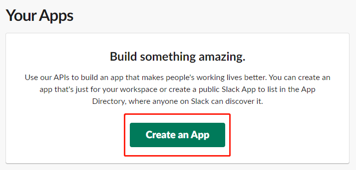
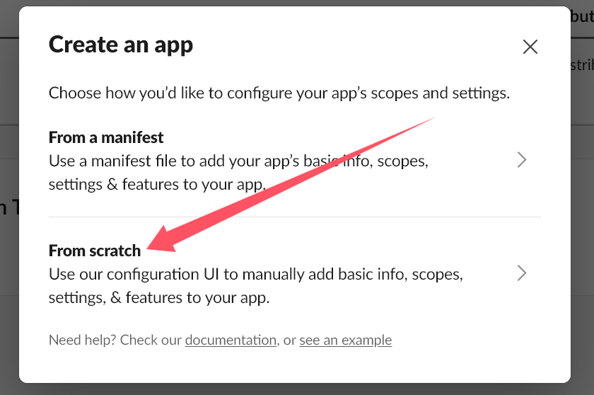
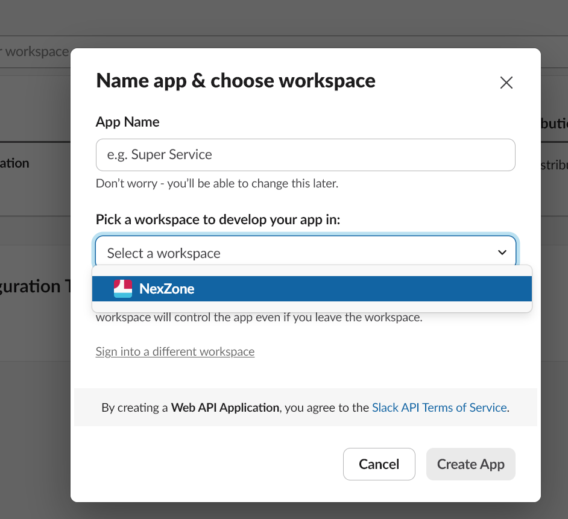
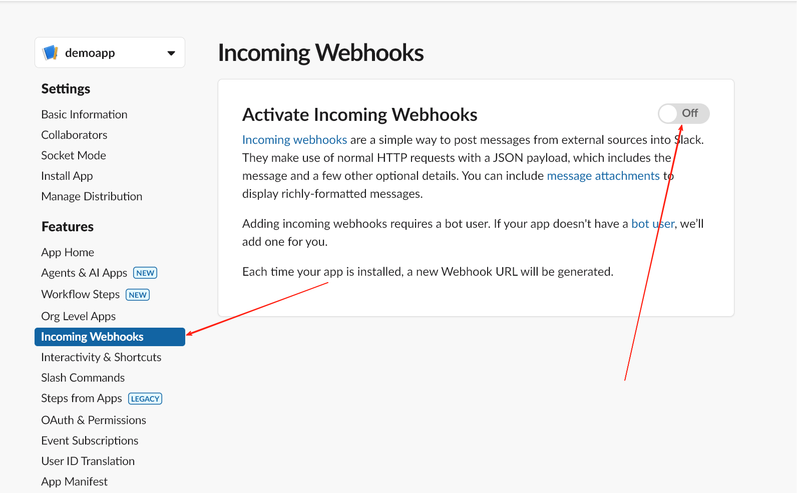
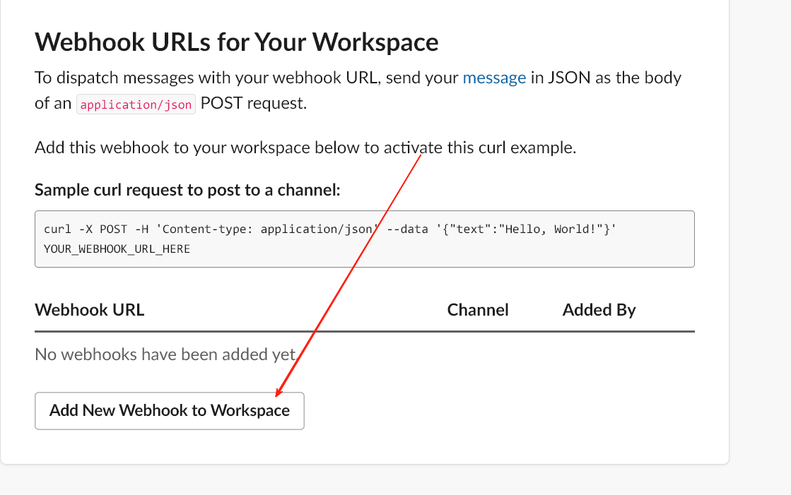
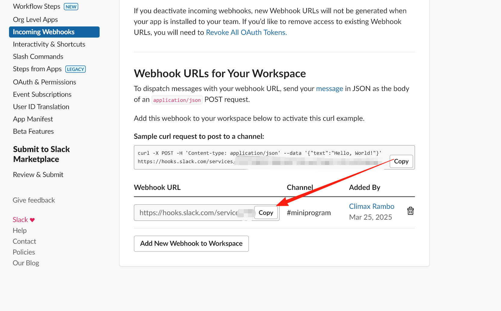
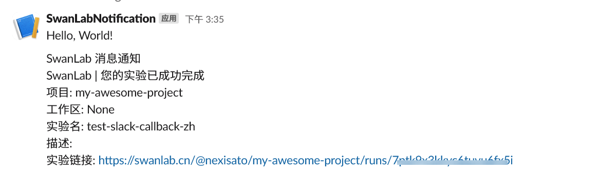

# Slack

如果你希望在训练完成/发生错误时，第一时间发送[Slack](https://slack.com)信息通知你，那么非常推荐你使用Slack通知插件。


:::warning 改进插件
SwanLab插件均为开源代码，你可以在[Github源代码](https://github.com/swanhubx/swanlab/blob/main/swanlab/plugin/notification.py)中查看，欢迎提交你的建议和PR！
:::

[[toc]]

## 准备工作

::: info 参考文档
- [Slack-使用传入的webhooks发送消息](https://api.slack.com/messaging/webhooks)
- [腾讯云-Slack群接收消息](https://cloud.tencent.com/document/product/1263/74219)
:::


1. 前往 [Slack-API](https://api.slack.com/apps) 页面，点击 **「Create an App」**




2. 在弹窗中点击 **「From scratch」**



3. 填写 **「App Name」** ，并选择用于通知的 workspace，点击右下角的 **「Create App」**



4. 进入 App 配置菜单后，点击左侧的 **「Incoming Webhooks」**，并开启 **「Activate Incoming Webhooks」** 按钮；



5. 在页面下方，点击 **「Add New Webhook to Workspace」**，将APP添加到工作区的频道中；




6. 在跳转的应用请求页面中，选择好APP要发送消息的频道，点击 **「允许」**


7.最后返回 APP 配置页面，复制APP的 Webhook URL




## 基本用法

使用Slack通知插件的方法非常简单，只需要初始化1个`SlackCallback`对象：

```python
from swanlab.plugin.notification import SlackCallback

slack_callback = SlackCallback(
    webhook_url='https://hooks.slack.com/services/xxxx/xxxx/xxxx', 
    language='zh'
)
```

然后将`slack_callback`对象传入`swanlab.init`的`callbacks`参数中：

```python
swanlab.init(callbacks=[slack_callback])
```

这样，当训练完成/发生错误时（触发`swanlab.finish()`），你将会收到Slack消息通知。




## 自由提醒

你还可以使用`SlackCallback`对象的`send_msg`方法，发送自定义的的Slack消息。

这在提醒你某些指标达到某个阈值时非常有用！

```python 
if accuracy > 0.95:
    # 自定义场景发送消息
    slack_callback.send_msg(
        content=f"Current Accuracy: {accuracy}",  # 通知内容
    )
```


## 限制

- Slack通知插件的训练完成/异常通知，使用的是`SwanKitCallback`的`on_stop`生命周期回调，所以如果你的进程被突然`kill`，或者训练机异常关机，那么会因为无法触发`on_stop`回调，从而导致未发送Slack通知。

- 完善方案请期待`SwanLab`的`平台开放API`上线。