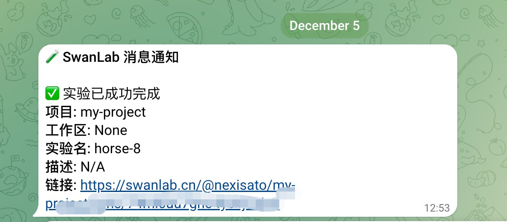

# Telegram

如果你希望在训练完成/发生错误时，第一时间发送[Telegram](https://web.telegram.org)信息通知你，那么非常推荐你使用Telegram通知插件。

:::warning 改进插件
SwanLab插件均为开源代码，你可以在[Github源代码](https://github.com/swanhubx/swanlab/blob/main/swanlab/plugin/notification.py)中查看，欢迎提交你的建议和PR！
:::

[[toc]]

## 准备工作

::: info 参考文档
- [Telegram-Bots: An introduction for developers](https://core.telegram.org/bots)
:::


1. 在 Telegram 搜索框中，输入 `@BotFather`


2. 进入聊天框，输入 `/newbot` 命令，根据提示，分别输入 `name` 和 `username`，注意：
- `name` 用于在消息框中展示 bot 名称
- `username` 用于 telegram 频道跳转，且必须以 `bot` 作为结尾，不可重复

完成创建后收到消息如下，复制并保存 `token`


3. 在 Telegram 搜索框中，输入 `@getidsbot`，在聊天框输入 `/start`，用于获取 `chat_id`。
`chat_id` 即用户的唯一标识符


## 基本用法

使用Telegram通知插件的方法非常简单，只需要初始化1个`TelegramCallback`对象：

```python
from swanlab.plugin.notification import TelegramCallback

telegram_callback = TelegramCallback(
    bot_token="<YOUR_TELEGRAM_BOT_TOKEN>",
    chat_id="<YOUR_TELEGRAM_CHAT_ID>",
    language="zh"
)

```

然后将`telegram_callback`对象传入`swanlab.init`的`callbacks`参数中：

```python
swanlab.init(callbacks=[telegram_callback])
```

这样，当训练完成/发生错误时（触发`swanlab.finish()`），你将会收到Telegram消息通知。




## 自由提醒

你还可以使用`Telegram`对象的`send_msg`方法，发送自定义的的Telegram消息。

这在提醒你某些指标达到某个阈值时非常有用！

```python 
if accuracy > 0.95:
    # 自定义场景发送消息
    telegram_callback.send_msg(
        content=f"Current Accuracy: {accuracy}",  # 通知内容
    )
```


## 限制

- Telegram通知插件的训练完成/异常通知，使用的是`SwanKitCallback`的`on_stop`生命周期回调，所以如果你的进程被突然`kill`，或者训练机异常关机，那么会因为无法触发`on_stop`回调，从而导致未发送Telegram通知。

- 完善方案请期待`SwanLab`的`平台开放API`上线。