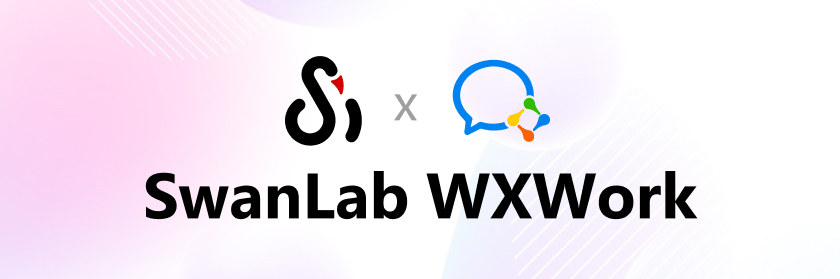
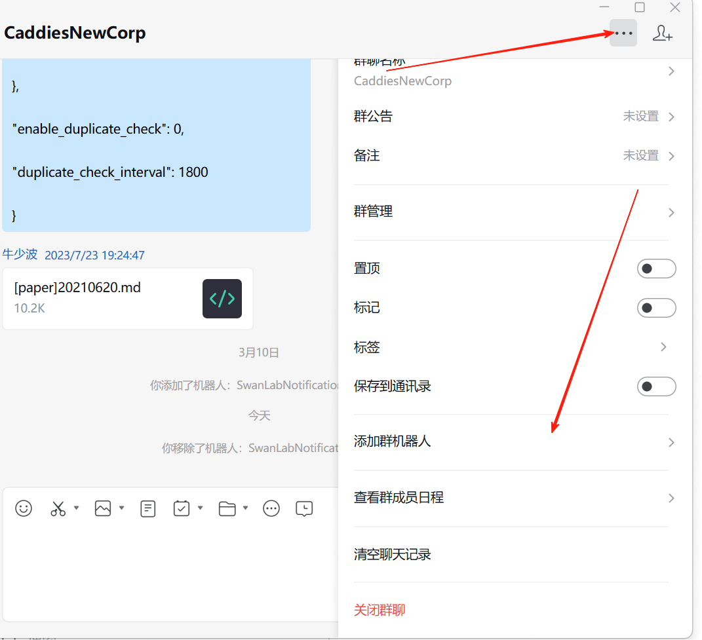
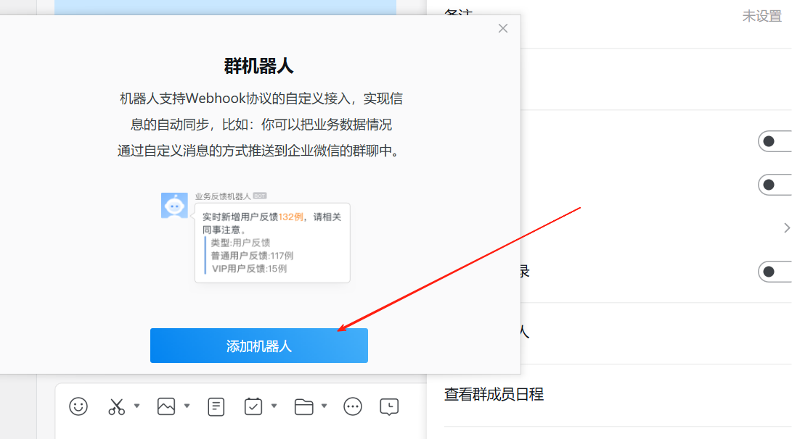
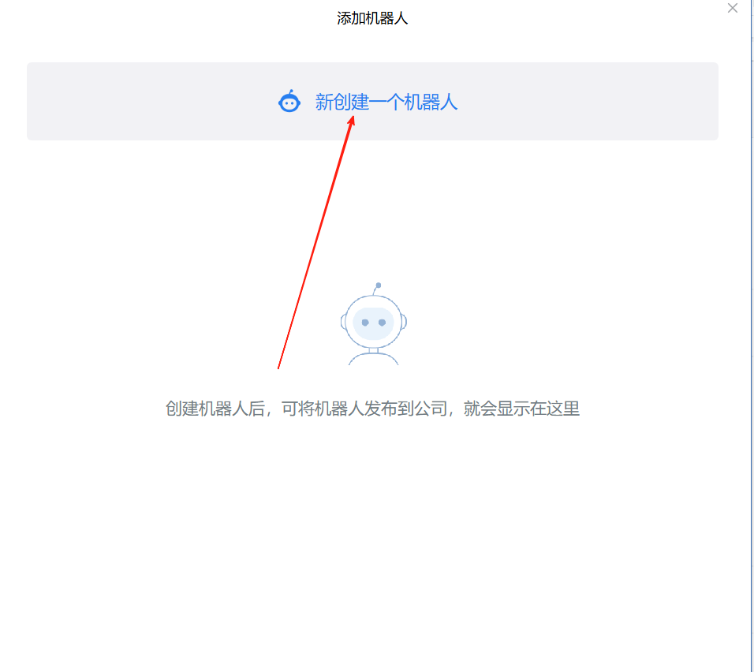
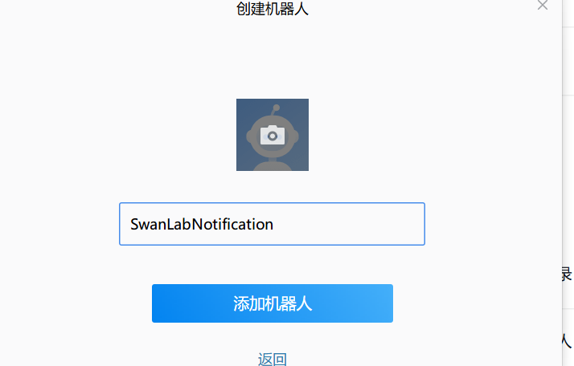
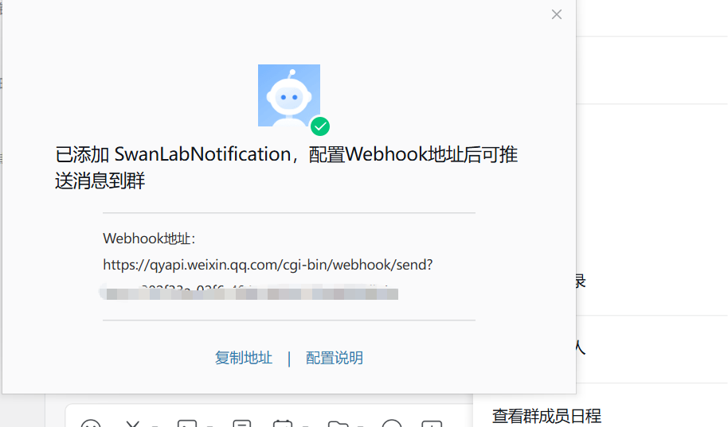
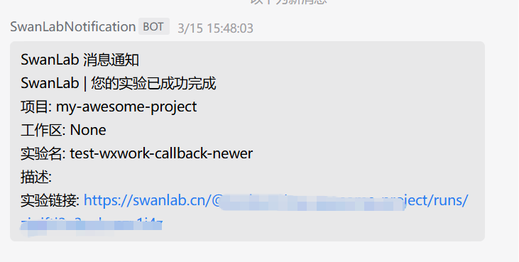

# 企业微信



如果你希望在训练完成/发生错误时，第一时间发送[企业微信](https://work.weixin.qq.com/)信息通知你，那么非常推荐你使用企业微信通知插件。

:::warning 改进插件
SwanLab插件均为开源代码，你可以在[Github源代码](https://github.com/swanhubx/swanlab/blob/main/swanlab/plugin/notification.py)中查看，欢迎提交你的建议和PR！
:::

[[toc]]

## 准备工作

::: info 参考文档
- [企业微信-群机器人配置说明](https://developer.work.weixin.qq.com/document/path/91770)
:::
1. 在企业微信群中，点击右上角的 **「···」-「添加群机器人」**



2. 在弹出的对话框中点击 **「添加机器人」**



3. 继续点击  **「新创建一个机器人」**



4. 为机器人添加名称，点击 **「添加机器人」**



5. 企业微信的机器人只需要复制 **「Webhook地址」** 即可



## 基本用法

使用企业微信通知插件的方法非常简单，只需要初始化1个`WXWorkCallback`对象：

```python
from swanlab.plugin.notification import WXWorkCallback

wxwork_callback = WXWorkCallback(
    webhook_url="https://qyapi.weixin.qq.com/cgi-bin/webhook/send?key=xxxx",
)
```

然后将`wxwork_callback`对象传入`swanlab.init`的`callbacks`参数中：

```python
swanlab.init(callbacks=[wxwork_callback])
```

这样，当训练完成/发生错误时（触发`swanlab.finish()`），你将会收到企业微信消息通知。




## 自由提醒

你还可以使用`WXWorkCallback`对象的`send_msg`方法，发送自定义的的企业微信消息。

这在提醒你某些指标达到某个阈值时非常有用！

```python 
if accuracy > 0.95:
    # 自定义场景发送消息
    wxwork_callback.send_msg(
        content=f"Current Accuracy: {accuracy}",  # 通知内容
    )
```


## 限制

- 企业微信通知插件的训练完成/异常通知，使用的是`SwanKitCallback`的`on_stop`生命周期回调，所以如果你的进程被突然`kill`，或者训练机异常关机，那么会因为无法触发`on_stop`回调，从而导致未发送企业微信通知。

- 完善方案请期待`SwanLab`的`平台开放API`上线。