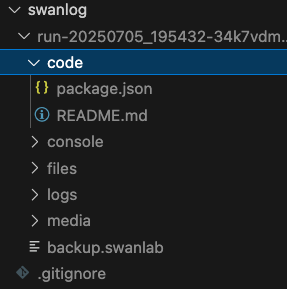

# 文件记录器

如果你希望在训练开始时，指定一些文件复制到日志目录（run开头的目录下），那么非常推荐你使用`LogdirFileWriter`插件。

:::warning 改进插件
SwanLab插件均为开源代码，你可以在[Github源代码](https://github.com/SwanHubX/SwanLab/blob/main/swanlab/plugin/writer.py#L175)中查看，欢迎提交你的建议和PR！
:::

## 插件用法

**1. 初始化LogdirFileWriter：**

```python
from swanlab.plugin.writer import LogdirFileWriter

logdirfile_writer = LogdirFileWriter(
    sub_dir="code",
    files=[
        "config.yaml",
        "README.md",
    ]
)
```

- `sub_dir`参数如果不为None，则在run目录下创建1个sub_dir文件夹来保存文件
- `files`参数指定了需要复制的文件列表（也支持仅传入1个str）。

**2. 传入插件：**

```python
swanlab.init(
    ...
    callbacks=[logdirfile_writer]
)
```

执行代码后，就会在`logdir`下对应的run开头目录下将`files`参数中的文件复制到该目录中（如果设置了`sub_dir`参数，则会复制到该子目录下）。


## 示例代码


```python
from swanlab.plugin.writer import LogdirFileWriter
import swanlab

logdirfile_writer = LogdirFileWriter(
    sub_dir="code",
    file_path=["package.json", "README.md"],
)

swanlab.init(project="test-plugin", callbacks=[logdirfile_writer])

swanlab.log({"loss": 0.2, "acc": 0.9})
swanlab.finish()
```



## 外部注册插件

<!--@include: ./shared-snippet.md-->


