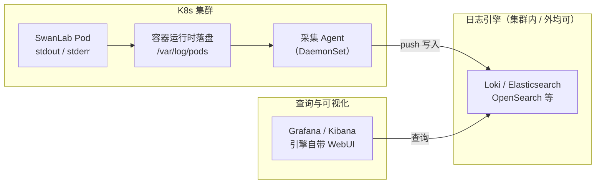

# 日志接入指南

> 本文档介绍 SwanLab 私有化服务在 Kubernetes 环境下的日志查看与接入方案。

## 🔍 快速查看日志

对于动态 Pod，可以通过 `kubectl logs` 查看并导出各服务的运行日志：

```bash
# 实时跟踪当前 Pod 日志（Ctrl+C 退出）
kubectl logs -n <YOUR_NAMESPACE> -f <POD_NAME> -c <CONTAINER_NAME>

# 导出当前 Pod 日志到本地文件
kubectl logs -n <YOUR_NAMESPACE> <POD_NAME> -c <CONTAINER_NAME> > swanlab-<CONTAINER_NAME>.log

# 导出上一次崩溃前的容器日志（容器因 CrashLoopBackOff 重启过才有输出）
kubectl logs -n <YOUR_NAMESPACE> <POD_NAME> -c <CONTAINER_NAME> --previous > swanlab-<CONTAINER_NAME>-previous.log

# 日志量较大时，只取最近 1000 行 / 最近 1 小时
kubectl logs -n <YOUR_NAMESPACE> <POD_NAME> -c <CONTAINER_NAME> --tail=1000 --since=1h
```

## ☁️ 接入云日志服务

如需持久化的日志存储与查询分析，推荐接入公有云日志服务（本文以<span style="color: red"><strong>阿里云SLS</strong></span>为例，**腾讯云 CLS**、**华为云 LTS** 等平台可按类似思路配置）。SwanLab 各服务日志均输出到容器 stdout/stderr，并携带标准 Pod 标签（`app.kubernetes.io/service`），接入云日志服务时**无需修改任何 SwanLab 配置**。

:::info
**采集原理**：阿里云采集组件 **LoongCollector** 在每个节点部署采集 Agent（_DaemonSet_），通过 CRD 资源 `AliyunLogConfig` 声明式配置采集规则，按 Pod 标签选择目标容器，日志自动写入 SLS 托管存储。其他云厂商提供类似的等效组件（腾讯云 LogConfig、华为云 lts-config 等）。
:::

### 1. 前置条件

**开通 SLS 日志服务**：进入 [SLS 控制台](https://sls.console.aliyun.com)，首次使用按提示开通（按量计费，开通免费）。

**安装采集组件（LoongCollector）**：进入 ACK 控制台 → 集群列表 → 点击目标集群 → 左侧 **组件管理** → 搜索 `LoongCollector` → 点击 **安装**：

- Project 选择**创建新 Project**，或选择已有 Project
- 安装完成后，集群会自动注册 CRD `aliyunlogconfigs`，并在每个节点部署采集 Agent

:::tip
LoongCollector 是原 `logtail` 组件的升级版，两者是替代关系、**不支持同集群并存**，可以通过以下指令查看：

```bash
# 根据输出：logtail-ds 为旧版，loongcollector-* 为新版
kubectl -n kube-system get ds | grep -iE "loongcollector|logtail"
```

两种组件下 `AliyunLogConfig` 的用法与本文后续步骤完全一致，参见 [Logtail 与 LoongCollector 兼容性说明](https://help.aliyun.com/zh/sls/logtail-and-loongcollector-compatibility)
:::

确认组件就绪：

```bash
kubectl -n kube-system get ds,deploy | grep -iE "loongcollector|logtail"
# 期望采集 Agent 的 DaemonSet 就绪副本数等于节点数，例如：ds/loongcollector-ds 4/4（不同版本 DS 名称可能略有差异）
```

**确认 RBAC 权限**：`AliyunLogConfig` 是自定义资源，内置的 `admin`/`edit` 角色不包含它。若当前用户权限不足，需要集群管理员在目标命名空间创建 Role（一次性操作）：

```bash
kubectl auth can-i create aliyunlogconfigs.log.alibabacloud.com -n <YOUR_NAMESPACE>

# 【注意】返回 `no` 时，请集群管理员执行下列命令用于创建日志采集角色权限：
kubectl create role swanlab-logconfig-writer -n <YOUR_NAMESPACE> \
  --verb=create,get,list,watch,update,patch,delete \
  --resource=aliyunlogconfigs.log.alibabacloud.com
kubectl create rolebinding swanlab-logconfig-writer -n <YOUR_NAMESPACE> \
  --role=swanlab-logconfig-writer --user=<YOUR_USER>
```

### 2. 创建采集配置

SwanLab 的业务服务均已将日志输出到容器 stdout/stderr，并携带标签 `app.kubernetes.io/service=<服务名>`，按服务分别创建采集配置（每个服务对应一个独立的 Logstore，便于按服务设置保留时长与查询）：

| 服务   | 说明              | 日志内容                             |
| ------ | ----------------- | ------------------------------------ |
| server | 核心业务 API 服务 | 用户请求处理、业务逻辑、接口错误堆栈 |
| house  | 指标OLAP服务      | 实验数据写入与同步、后台任务执行     |
| auth   | 认证鉴权服务      | 登录认证、令牌校验、权限相关请求     |

三个服务的采集配置除 `metadata.name`、`logstore`、`configName` 与标签值外完全一致。执行前请替换文件中的占位符（均已用注释标出）：`<YOUR_NAMESPACE>` 为 SwanLab 所在命名空间（需与各 `K8sNamespaceRegex` 保持一致）；`<PROJECT_NAME>` 为可选的目标 SLS Project，不填则写入集群绑定的默认项目 `k8s-log-<集群ID>`。

::: details 采集配置模板（swanlab-log.yaml）

```yaml
# 占位符说明：
#   <YOUR_NAMESPACE>：SwanLab 服务所在的 K8s 命名空间，需与下方每段 K8sNamespaceRegex 保持一致
#   <PROJECT_NAME>  ：可选。目标 SLS Project；需写入自定义 Project
apiVersion: log.alibabacloud.com/v1alpha1
kind: AliyunLogConfig
metadata:
  name: swanlab-server
  namespace: <YOUR_NAMESPACE>
spec:
  project: <PROJECT_NAME> # 取消注释可将日志写入自定义 Project
  logstore: swanlab-server # 日志库，不存在时自动创建
  ttl: 7 # 日志保留天数，按需调整
  shardCount: 2
  logtailConfig:
    configName: swanlab-server # 与 metadata.name 保持一致
    inputType: plugin
    inputDetail:
      plugin:
        inputs:
          - type: service_docker_stdout
            detail:
              Stdout: true
              Stderr: true
              K8sNamespaceRegex: ^<YOUR_NAMESPACE>$ # 必须显式限定命名空间
              IncludeK8sLabel:
                app.kubernetes.io/service: server # 按标签圈选目标服务
---
apiVersion: log.alibabacloud.com/v1alpha1
kind: AliyunLogConfig
metadata:
  name: swanlab-house
  namespace: <YOUR_NAMESPACE>
spec:
  project: <PROJECT_NAME>
  logstore: swanlab-house
  ttl: 7
  shardCount: 2
  logtailConfig:
    configName: swanlab-house
    inputType: plugin
    inputDetail:
      plugin:
        inputs:
          - type: service_docker_stdout
            detail:
              Stdout: true
              Stderr: true
              K8sNamespaceRegex: ^<YOUR_NAMESPACE>$
              IncludeK8sLabel:
                app.kubernetes.io/service: house
---
apiVersion: log.alibabacloud.com/v1alpha1
kind: AliyunLogConfig
metadata:
  name: swanlab-auth
  namespace: <YOUR_NAMESPACE>
spec:
  project: <PROJECT_NAME>
  logstore: swanlab-auth
  ttl: 7
  shardCount: 2
  logtailConfig:
    configName: swanlab-auth
    inputType: plugin
    inputDetail:
      plugin:
        inputs:
          - type: service_docker_stdout
            detail:
              Stdout: true
              Stderr: true
              K8sNamespaceRegex: ^<YOUR_NAMESPACE>$
              IncludeK8sLabel:
                app.kubernetes.io/service: auth
```

:::

创建并确认生效：

```bash
kubectl apply -f swanlab-log.yaml

# 查看 status，期望输出为 success
kubectl get aliyunlogconfig -n <YOUR_NAMESPACE>
```

其中，**`K8sNamespaceRegex` 必须显式填写**：漏填会把其他命名空间中同标签服务的日志混采进来

### 3. 验证

稍等约 1 分钟，在 [SLS 控制台](https://sls.console.aliyun.com) 打开对应项目，验证对应服务的 `Logstore` 已创建。


:::tip
**计费说明**：SLS 按写入量、存储量、索引、查询分别计费，`ttl` 保留天数是主要的成本控制手段。删除 CR 只删除采集配置，Logstore 与历史日志需在 SLS 控制台手动清理。
:::

## 🌐 其他平台

私有化服务不绑定具体日志平台，采用标准的 **平台托管采集 Agent + 声明式配置按标签圈选 + 云日志服务查询** 采集方案：

| 平台       | 采集 Agent                               | 配置方式                        | 日志后端                 |
| ---------- | ---------------------------------------- | ------------------------------- | ------------------------ |
| 阿里云 ACK | loongcollector（原 logtail，互斥二选一） | AliyunLogConfig CRD             | SLS 日志服务             |
| 腾讯云 TKE | cls-agent                                | LogConfig CRD                   | CLS 日志服务             |
| 华为云 CCE | ICAgent                                  | CCE 控制台配置 / LTS 侧配置     | LTS 日志服务             |
| 自建集群   | Fluent Bit、Grafana Alloy、Vector        | DaemonSet + ConfigMap（无 CRD） | Loki、OpenSearch、ELK 等 |

各平台的接入步骤一致：**安装采集 Agent → 声明采集规则（CRD 或配置文件）→ 按标签圈选目标容器 → 日志写入后端服务**。以腾讯云 TKE 为例：安装 cls-agent 组件后，创建 `LogConfig` CR 并按 `app.kubernetes.io/service` 标签圈选 SwanLab 服务，即可在 CLS 控制台查询，操作与本文阿里云章节完全同构。

## 🛠️ 自建日志方案

对于无法使用云日志服务的环境（如离线机房、数据合规要求），可以接入自建日志平台。无论选择哪个日志引擎，K8s 日志的流转链路是一致的：



链路说明：

1. **产生**：SwanLab 各服务将日志写入容器 stdout/stderr，容器运行时将其落盘为节点上的 `/var/log/pods/<YOUR_NAMESPACE>_<pod>_<uid>/<container>/*.log` 文件
2. **采集**：采集 Agent（Alloy / Fluent Bit / Vector 等）以 DaemonSet 方式运行在每个节点，从日志文件中读取增量内容，解析出 namespace、pod、container 等元数据并附加为日志标签
3. **写入**：Agent 将日志推送到日志引擎（Loki,OpenSearch, Elasticsearch, VictoriaLogs 等），日志引擎负责存储、索引与保留策略（TTL）
4. **查询**：通过日志引擎配套的可视化界面(Grafana, Kibana 与日志引擎自带 WebUI 等)，按标签（namespace / pod / level）与关键字检索

:::warning
自建方案需要自行准备以下组件，选型与部署方式建议尽量对齐公有云日志服务的形态：

- **日志采集器**：以 DaemonSet 运行的采集 Agent（如 Fluent Bit、Grafana Alloy、Vector）
- **日志引擎**：负责存储、索引与查询的服务（如 Loki、Elasticsearch、OpenSearch）
- **持久化存储**：依赖集群的 CSI 存储插件提供 PVC
:::
